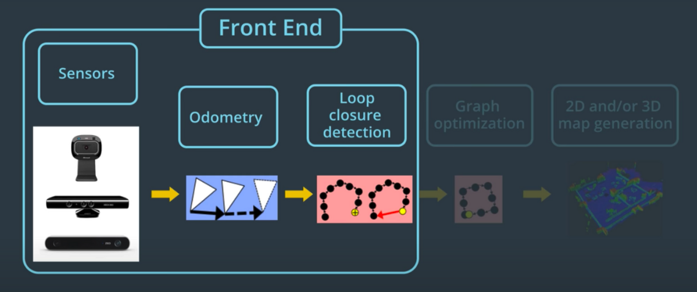
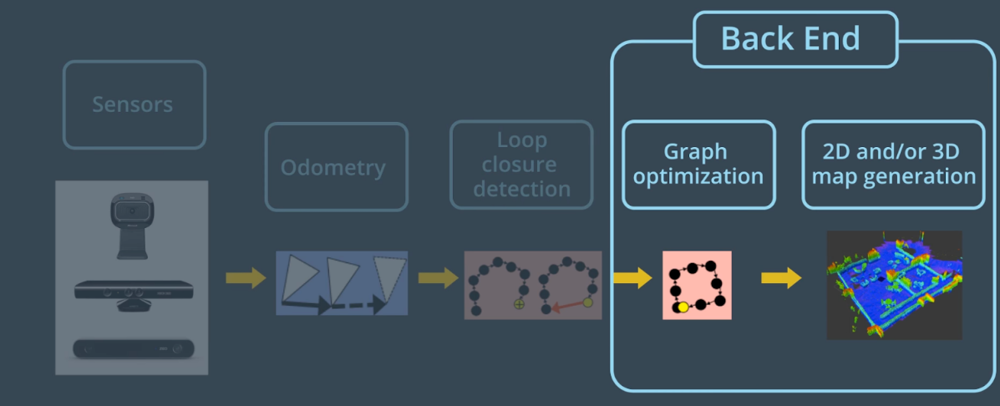
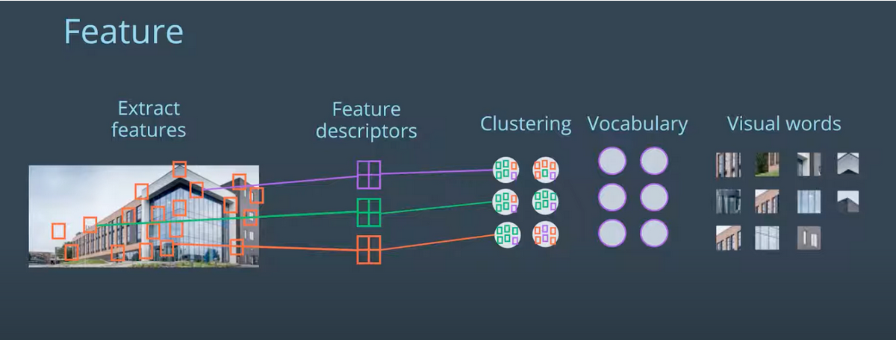
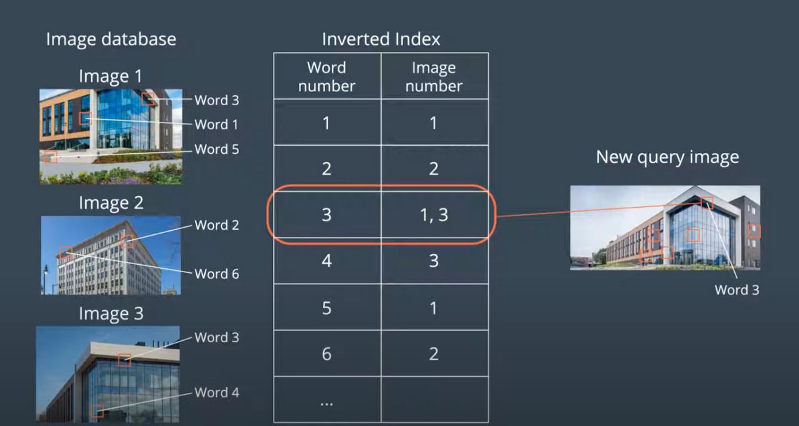
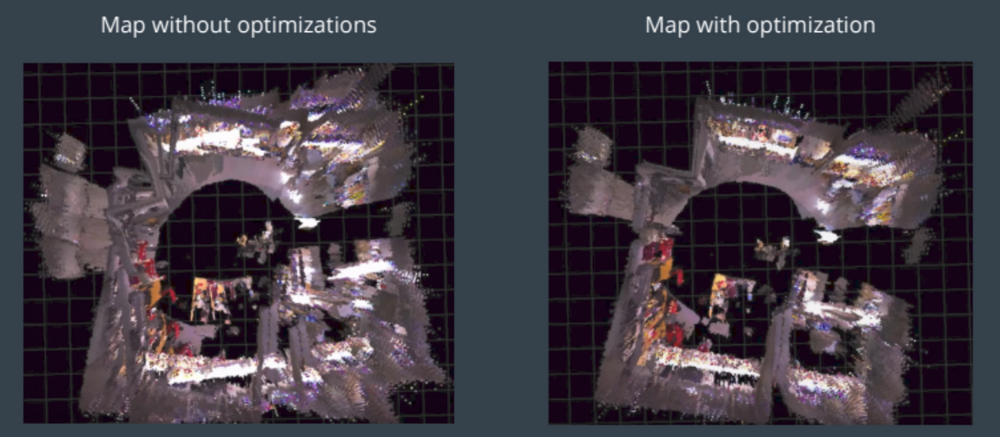
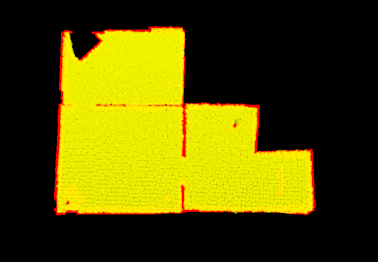
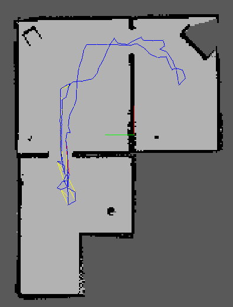

# Map My World

  

This project showcases the application of a package called RTAB-Map(Real-Time Appearance-Based Mapping) for SLAM application. Under the hood, RTAB-Map is a graphSLAM algorithm that only uses images from a monocular camera and the odometry readings to perform full SLAM to create occupancy grid map and 3D point cloud of the environment in real time. This algorithm works by dividing the work into frontend and backend tasks. 

## Frontend

The frontend focuses on using the sensor data from the camera to obtain the features of the environment. These features are then tied together using constraints provided by the odometry. The features and poses calculated from the odometry are tied together form a graph. 

  

The algorithm keeps extracting out the interesting features from the camera images and keeps labelling as it's moving. Each of these labels are associated with a certain location on the map. These associations are called constraints. When the robot identifies the location it has been at before, it creates something called “loop closure”. The loop closure helps link two different poses at two different points in time with the same feature in the environment and it helps immensely in the backend where the graph is run through a graph optimization algorithm to reconstruct the 2D and 3D maps.

## Backend

  

Backend of RTAB-Map includes the optimization of the graph created by the frontend and it generates occupancy grid from the data of the map. 

## Loop Closure

Loop closure in RTAB-Map is accomplished using a bag-of-words approach. The image from the camera is first analysed to extract features using a method called speeded up robust feature or “SURF’. These could be made up of anything from variation in the texture or an edge or a corner. These features are given a unique identifier called a feature descriptor. Comparing a new feature with other already detected features is very time consuming, therefore similar features are clustered together to form a vocabulary of features. When a new found feature is matched up with one of the synonyms in the vocabulary, we call the feature to be quantized. This feature is called a word. When each of the features is quantized, the whole image is therefor chopped up and called a bag of words

  

Each word is linked to the image it was seen making the image retrieval process easier in the future. 

When a new image is queried, it is broken in bag-of-words. Each of its words is compared to the words in the database. When a match is found the image with the matched word in the database is given a score. This process of scoring the images is accomplished using inverted Index. The an image in the database gets a high enough score, a loop closure is declared. 

  

## Graph Optimization

When a loop closure is detected, another constraint is added into the graph. This graph is then sent to the optimizer to minimise the errors in the map. Note that the optimizer uses robot pose stored in each node and the link transformation between the nodes as constraints. When a loop closure is detected, the errors introduced by the odometer are propagated to all the links, which then corrects the map. 

Following photos show the 3d map before and after the optimization process,

  

## Map Outputs

RTAB map can out multiple different types of maps such as 2D occupancy grid map, 3D occupancy grid map or a 3D point cloud map. 

  

  
  

  

  
  

  

  
  

 

